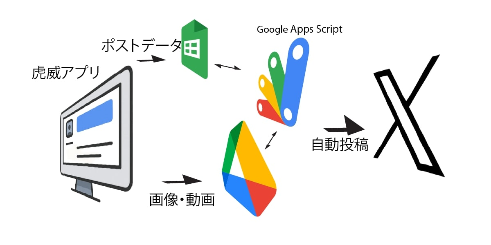

# はじめに

この度は、X 自動投稿ツール「虎威」をご購入いただき、誠にありがとうございます。このツールが、あなたの稼ぎのスピードを上げ、稼ぎを大きくする手助けになることを願っています。

- ご不明な点
- 動作の不具合
- 機能追加

など、ご遠慮なく[メール](mailto:support@imakita3gyo.com)にてお知らせください。

サポートにいただいたメールは原則 24 時間以内に返信します。24 時間が経過後も返信がない場合は不達の可能性が高いため、お手数ですが再度ご連絡いただくようお願いします。

## X 自動投稿ツール「虎威」とは？

「虎威」は、X へのポストを指定した時間に自動で投稿するアプリケーションです。

また、AI を使用したキーワードからの投稿原稿の一括作成、スレッド投稿などの投稿支援、バズ支援機能も備えています。

これまでの「Google シート方眼紙」の編集のワズらわしさから解放され、X の投稿画面とほぼ同じ画面で投稿を作成・編集できます。

### 特徴

- **<u>⭕ Google アプリをバックエンドツールとして使用</u>**
  - Google シートを投稿データ管理に
  - Google ドライブを画像・動画管理に
  - Google Apps Script で PC オフでも自動投稿プログラム実行
- **<u>⭕️ 投稿作成は GUI で</u>**
  - スプレッドシートに書き込んでいた作業から GUI で入力
  - 画像の選択はマウスクリックで
  - 投稿時刻設定も個別・一括設定がクリックだけで
- **<u>⭕️ スレッド投稿が予約できる</u>**
  - クリックだけでスレッド投稿の予約が完成
- **<u>⭕️ AI でキーワードからポストを一括作成</u>**
  - キーワード入力だけでポストを一括作成
  - 編集し選択するだけでポスト作成完了
- **<u>⭕ Web アプリだからスマホからも操作</u>**
  - スマホからの操作も可能で空き時間を有効利用
- **<u>⭕ 複数アカウント対応</u>**

### 今までの自動投稿ツールツールとの違い

これまでの X の自動投稿ツールは、

- スレッド投稿の予約ができない
- 複数アカウントが使えない
- Google Sheet 上での細かい作業が必要
- 画像・動画のアップロードには別途 Google Drive へアップし URL を取得して貼付

と、使い勝手が非常に悪いものばかりです。

「虎威」は、Web アプリですから操作性が非常に良く、複数アカウントにも対応しています。

|       項目        |                虎威                 |        X(Twitter)投稿ツール         |           Socialdog           |
| :---------------: | :---------------------------------: | :---------------------------------: | :---------------------------: |
|       価格        |              32,780 円              |              21,800 円              |         月額 1,480 円         |
|  複数アカウント   |              &#x2B55;               |              &#x2B55;               |         1 アカウント          |
|     投稿方法      | Google スプレッドシートからの X API | Google スプレッドシートからの X API | 独自システムからの X API 経由 |
| X の API キー取得 |                必要                 |                必要                 |             不要              |
|  有料プラン対応   |              &#x2B55;               |              &#x2B55;               |             不明              |
|    投稿限度数     |              X の制限               |              X の制限               |             不明              |
|    高度ポスト     |              &#x2B55;               |              &#x2B55;               |           &#x2B55;            |
|  ポスト作成支援   |               AI 利用               |              &#x274C;               |           &#x274C;            |

- 高度ポストとはスレッド投稿、リプライ投稿です。
- X の制限とは、X での API 使用での投稿は 1 アカウント 1 日 17 件（無料プラン）です。

### 制限

虎威は、Google シート、Google ドライブ、X への投稿を行う際にそれぞれの制限があります。

### Google の制限

- 虎威との送受信、X への投稿でプログラムが稼働する時間　 90 分/日
- 1 回のプログラムの実行時間　 6 分以内
- 外部へのアクセス 20,000 回/日
- 送受信データ 50MB/回
- トリガー 20 個

### X の制限

- 無料アカウントは 17 ポスト/日
- 動画のファイルサイズ 512MB

動画のアップロードを行う場合、ファイルサイズに気を付けてください。Google からアップロードで 6 分以上かかる場合はエラーになります。

### それでは自動投稿の準備を始めましょう。
