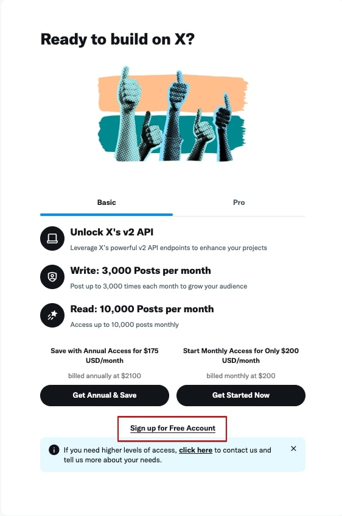

# X へプログラムから投稿

X を含め、SNS には投稿をプログラムで行うボット（bot）と呼ばれるものがあります。

SNS 側もプログラムから投稿を受け付けるため手順とエンドポイントと呼ばれる URL を公開しています。

## 認証にはキーが必要

プログラムから投稿する際にも「ログイン」に相当する認証が必要です。その認証を行うために SNS 側はアカウント毎にキーを発行し、プログラム側はキーを使い認証を受けます。

他人のアカウントのキーが手に入れば「なりすまし（アカウント乗っ取り）」が可能ですので取得したキーは安全に保管してください。

## 制限

プログラムから投稿することができると、無限に投稿が可能となります。無限に投稿されてはサーバーやリソースに負担がかかりますので、SNS 側では制限を設けています。

X の場合は、無料プランも用意されていますが投稿は 1 日 17 投稿と制限があります。有料プランに変更すれば投稿数を増やすこともできます。

|   項目   |     無料     |                 ベーシック                  |                      プロ                       |
| :------: | :----------: | :-----------------------------------------: | :---------------------------------------------: |
|   価格   |     無料     |                200 米ドル/月                |                 5,000 米ドル/月                 |
|  投稿数  | 1 日 17 投稿 | アカウント毎:3,000 件、アプリ全体:50,000 件 | アカウント毎:288,000 件、アプリ全体: 300,000 件 |
|  読取り  |  100 件/月   |                15,000 件/月                 |                    百万件/月                    |
| アプリ数 |      1       |                      2                      |                        3                        |

## X での API キーの取得

それでは、X への自動投稿のために API キーを取得します。投稿するアカウント毎に必要です。

[X の開発者用のサイト](https://developer.x.com/en)へアクセスします。

### サインイン

右側上部にある「Sign In」をクリックします。


投稿するアカウントで X へサインインします。


サインインが完了しましたら、下へスクロールします。


### プラン選択

プランの選択テーブルがありますので、「Free」の下にある「Get Started」をクリックします。


有料プランを勧めてきますが、「Sign up for Free Account（無料アカウントでサインアップ）」を選択します。X のプレミアムプランなどとは別です。


### 開発者アカウント申請と利用規約への同意

開発者アカウントの申請と開発者としての同意を求められます。

最初の赤枠部分は、API が必要な理由を書き込みます。

以下は、Grok3 に作成してもらいました。

同様に、Grok3 に<br />

> X の API を申請しますが、"Desribe all of your use cases of Twitter's data and API"に書き込む英文を作成してください。

と作成してもらうとカンタンです。

- **理想的な英文例**：
  ```markdown
  I plan to use the X API to automate posting tweets from a Google Apps Script application. The application will schedule and publish tweets to share updates, announcements, or insights with my followers. Additionally, I aim to retrieve tweet performance metrics, such as impressions and engagement rates, to analyze the effectiveness of my content. This project is intended for personal or small-scale business use to enhance social media presence efficiently.
  ```
- **ポイント**：

  - 具体的な使用目的（投稿の自動化、分析など）を明記。
  - 商用利用の場合は規模を説明。
  - スパムや不適切な利用でないことを強調。

#### チェックボックス

- You understand that you may not resell anything you receive via Twitter APIs.(Twitter API 経由で受け取るものは、いかなるものも販売しません。)
- You understand your Developer account may be terminated if you violate the Developer Agreement or any of the Incorporated Developer Terms.（開発者契約または付随する開発者規約に違反した場合、開発者アカウントを解約される可能性があることを利用者は了承するものとします）
- You accept the Term & Conditions.（利用規約に同意します。）

3 つのチェックボックスを ON にし「Submit（送信）」ボタンをクリックします。


### プロジェクトの作成

規約への同意が完了するとプロジェクトが作成されます。

ダッシュボード画面です。有料プランの場合は、ここにスク数のプロジェクトが表示されます。


左側メニューの「Projects & Apps」の下の「Overview(概要)」をクリックするとプロジェクトの概要が表示されます。


左側メニューの「プロジェクト名」をクリックするとプロジェクトの詳細が表示されます。

#### 権限の変更

「Set up」をクリックします。


ユーザー認証設定画面になります。

- App permissions(アプリの権限)を「Read adn write and Direct message」を選択します。
- Request email from users(ユーザーからのメールを要求)は**OFF**に
- Type of App は、「Web App, Automated App or Bot」を選択します。
- App info

  - Callback URI/Redirect URL は、Google シートの Apps Script をデプロイした URL を貼り付けます。
  - Website URL はお手持ちのブログなどサイトの URL を、https://doc-torai.try-try.comを使われても構いません。

最後に「Save」をクリックします。


#### キーの作成

「Changing permissions might affect your App（権限変更はアプリに影響します。）」と確認がでます。「Yes」をクリックします。


画面がプロジェクト詳細にもとりますので、プロジェクト名の下にある「Keys and tokens」タブをクリックします。


Consumer Keys の「Regenerate（再作成）」をクリックします。初回でも再作成と出てきます。


確認のダイアログが表示します。「Yes, regenerate（はい、再作成します。）」をクリックします。


##### API キー

- API Key
- API Key Secret

の 2 つが表示しますので、それぞれコピーしテキストエディターなどに貼り付けてください。閉じると見ることができなくなり、再作成となります。

「Yes, I saved them（はい、保存しました。）」をクリックします。


#### Access Token

次に、Access Token を取得します。「Generate（作成）」ボタンをクリックします。


- Access Token
- Access Token Secret

の 2 つが表示されます。同じようにコピーをクリックしテキストエディターなどに貼り付けます。「Yes, I saved them（はい、保存しました）」ボタンをクリックします。


以上で X での設定は完了です。

お疲れ様でした。
