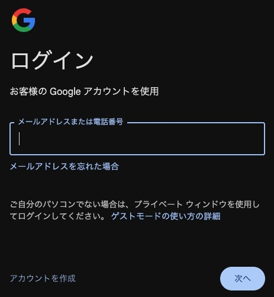
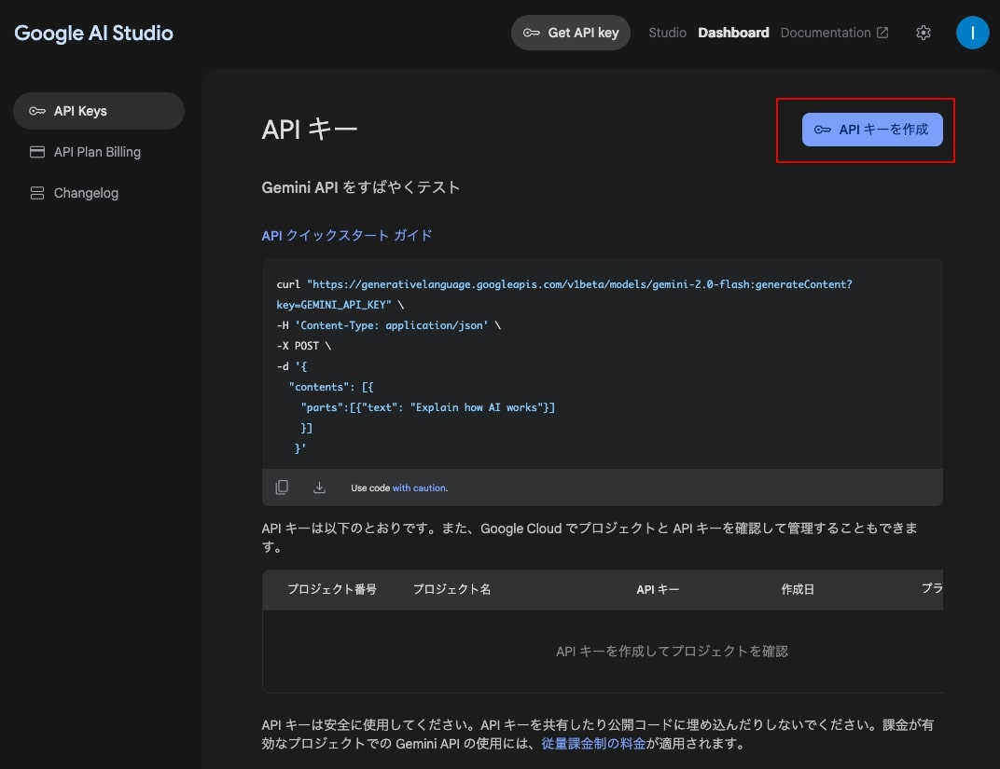
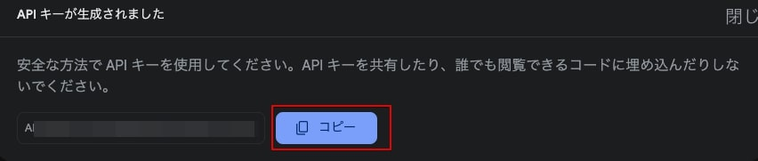
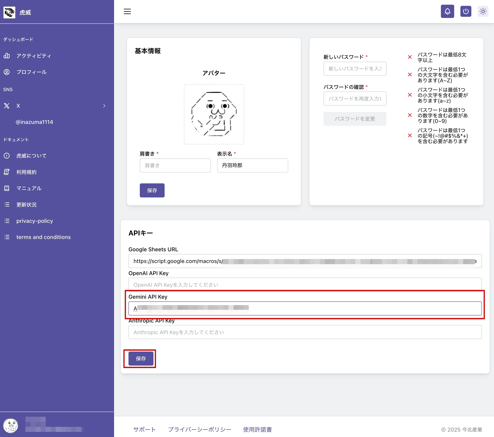

# Google AI Studio

## Google Gemini API Key の取得

[Google AI Studio](https://aistudio.google.com/welcome)へアクセスします。

「Sign in to Google AI Studio」ボタンをクリックします。

Google 認証を求められますので認証します。

認証が完了しましたら、ポップアップが表示されます。「Get API key」をクリックします。

右上にある「API キーを作成」ボタンをクリックします。

キーが生成され、ポップアップが表示します。コピーボタンをクリックします。

「閉じる」をクリックしてポップアップを閉じます。

虎威のプロファイルを選択し、Google Gemini API キーを貼付け、保存ボタンをクリックします。

以上で、Google Gemini を使用して X のポストを作成する準備ができました。
