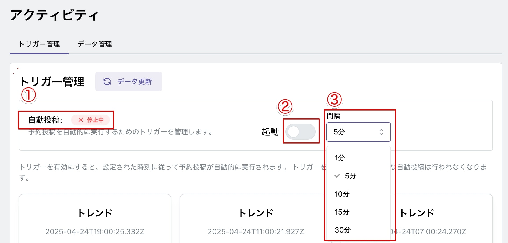

# 虎威へのサインインと設定

虎威は Web アプリケーションです。

インターネットへ接続されたブラウザがあれば、どこからでも操作できます。

ブラウザ（Google Chrome 推奨）を開き、ポータルサイトへアクセスしてください。

## ポータルサイト

虎威のポータルサイトは、

- [体験版](https://torai-preview.try-try.com)
- [製品版](https://torai.try-try.com)

があります。

### 体験版

体験版は、Google アカウントをお持ちでしたら、どなたでもスグにサインインしていただけます。

準備、使い方は製品版と同じです。

製品版との違いは、投稿日時の設定が 30 回（新規設定・更新）の制限があるだけです。

### 製品版

こちらは、購入時のメールアドレス、パスワード（購入時に発行）でサインインしていただきます。体験版で使用された Google シートの URL、X アカウントのキーなどは、プロフィール画面から再度設定してください。

## サインイン

ポータルサイトの「はじめる」、「サインイン」ボタンをクリックするとサインイン画面が表示されます。

### 体験版

### 製品版

## 設定

サインインが完了しましたら、設定を行います。

最初に、「利用規約への同意」が必要です。

### 利用規約への同意

利用規約への同意をお願いします。

利用規約には、ニュースレターの購読への同意も含まれています。ニュースレターはいつでもワンクリックで購読解除ができます。

同意が完了すると、Google シートからのデータのダウンロードを開始しますが、Google シートの URL が未設定のためエラーが表示されます。

### プロフィール画面

左側メニュー「プロフィール」を選択してプロフィール画面を表示してください。

アバターと名前が設定されている場合があります。これは、体験版へ Google アカウントでログインされると、Google へ設定されているアバターと表示名が自動で入るためです。

製品版では、アバターの設定、肩書き、表示名の設定を行っていただけます。

プロフィール画面は、

1.  基本情報
2.  パスワード変更
3.  Google シート、AI 提供元の API キー

の設定ができます。

#### Google シート

投稿情報を保存し、拡張機能で投稿を行う Google シートの公開 URL を貼り付けます。

#### Google Gemini API キー

AI でポストを自動生成するために Google Gemini の API キーを貼付て保存します。Google Gemini は利用制限がありますが無料で使えます。

## アクティビティ

左側メニューの「アクティビティ」を選択します。

アクティビティ画面では、Google シートのデータ、自動投稿の状態を管理します。

アクティビティ画面には、

- トリガー管理
- データ管理

の 2 つのタブがあります。

### トリガー

トリガータブは、自動投稿の状態の表示・起動・停止を行います。

### 投稿データ

投稿データタブは、さらに 3 つのタブを持ちます。

- 投稿予定
- 投稿済み
- エラー

の 3 つのタブを持ちます。

それぞれのタブが、Google シートのデータをダウンロードして表示します。

Google シートには、最初のダウンロード時に、

- 投稿予定（Posts）
- 投稿済み（Posted）
- エラー（Errors）

のシートが自動で作成され、1 行目には項目名が記入されます。

