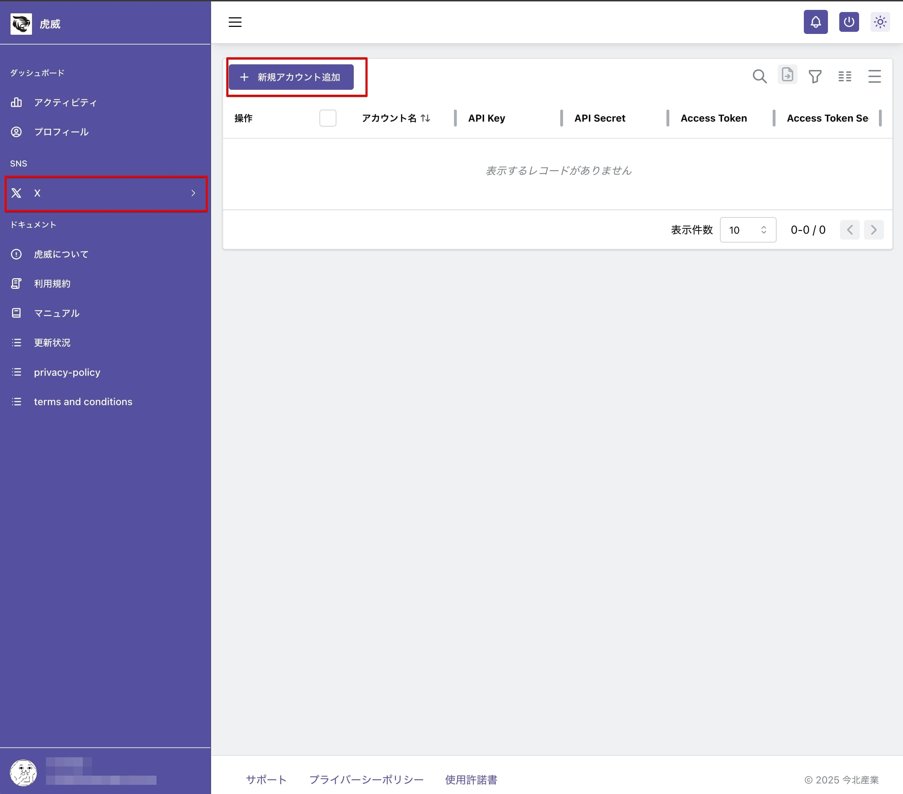
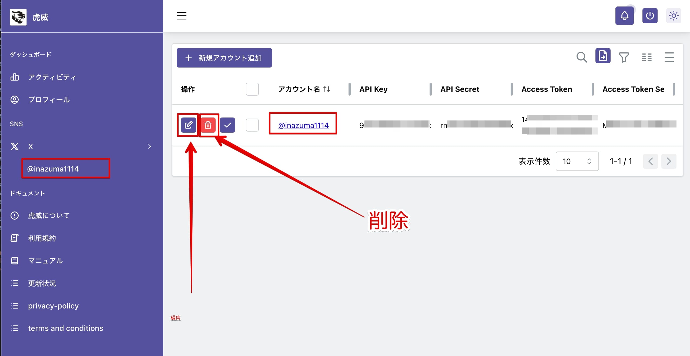

import Image from '@theme/IdealImage';

# X アカウント管理

左側メニューの「X」を選択してください。
自動投稿先の X のアカウントを管理する画面です。

複数の X アカウントを登録・管理できます。

ここに登録された X アカウントは、Google シートの Apps Script に保存されます。当社の管理下にはありませんのでご安心ください。

## X アカウント画面

登録されている X のアカウント一覧を表示します。

### X アカウント新規登録

自動投稿を行うための X アカウントを登録します。

登録に必要な情報は、

- アカウント名（@から始まるアカウント名）
- API Key
- API Key Secret
- Access Token
- Access Token Secret

です。

「新規アカウント追加」ボタンをクリックします。

<Image img="/img/xa02.jpg" alt="Xアカウント新規登録" style={{ width: '350px', height: 'auto' }} />
登録用のポップアップが表示しますので、必要な情報を入力し「＋」をクリックします。Google シートへ情報を送り、保存が完了すると一覧に表示されます。

また、左側メニューの X の項目に追加されます。

### X アカウント編集・削除

X アカウント一覧の左側にある「編集」、「削除」ボタンをクリックすると編集・削除できます。

