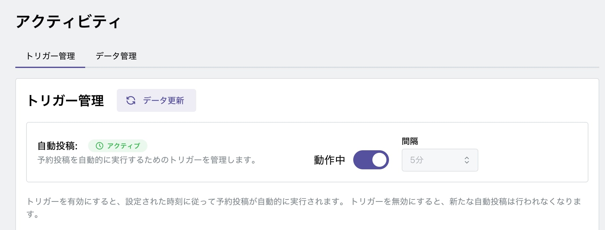

# 投稿スケジュール作成

自動投稿する日時をポスト毎に設定します。

最初にトリガーの間隔と投稿動作について解説します。

## トリガー間隔と投稿動作

トリガーとは投稿プログラムを発動することで、間隔を「1 分、5 分、10 分、15 分、30 分」から選択できます。

下図は、5 分間隔でトリガーを設定した場合です。

「10 時 16 分」に東湖時刻が設定してありますが、トリガーは 5 分間隔で起動します。

虎威の仕様として、トリガーにより投稿プログラムが起動されると、トリガー間隔（この場合は 5 分）に 1 分を加えた時間内の投稿があるかをチェックします。

下図の場合ですと、「10 時 16 分」の設定がありますので、このポストを投稿します。投稿時刻は開始が「10 時 15 分」になります。

虎威はひとつの投稿が完了すると投稿プログラムは完了し、次のトリガーを待ちます。

そのため、次の「10 時 18 分」の設定は、次回トリガー「10 時 20 分」に起動した際に投稿されます。

このようにトリガー間隔の中に複数の投稿時刻設定がある場合には、トリガー間隔を「1 分」に設定してください。

## 個別投稿スケジュール作成

ポスト毎に投稿時刻を設定できます。

ポスト一覧から編集アイコンをクリックし、投稿日時を指定し保存します。

## 一括投稿設定

複数の投稿を一括で設定も可能です。

下図のように複数の投稿を選択し、「一括スケジュール設定」アイコンをクリックします。

スケジュール設定フォームが開きます。

このフォームでは、

- 日付
  - 開始日
  - 終了日
- 時間
  - 開始時間
  - 終了時間

を指定しスケジュールの時間帯を設定し、その間に間隔で時刻設定を行います。

下図の例では、4 日から 7 日の 12 時 30 分から 15 時 30 分の間に 30 分間隔で投稿スケジュールを組み、ポストを割り当てていきます。

トリガーの間隔では設定時刻ピッタリに投稿されません。

## トリガー開始

投稿予約を行った場合には、アクティビティ画面でトリガーを開始にしてください。

