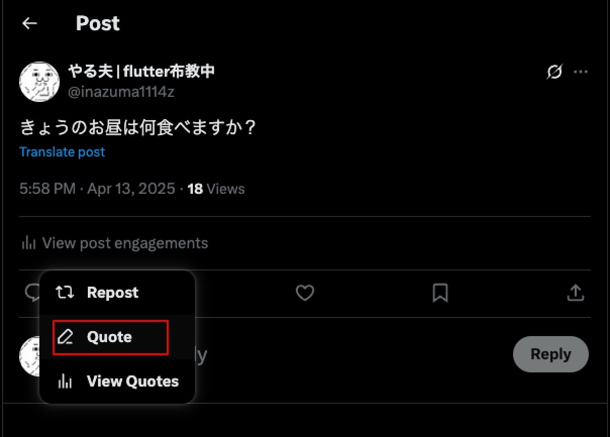

# スレッド投稿

虎威では、投稿をリプライで繋ぐスレッド投稿を予約で行えます。

## X のポスト

X での投稿は 3 つのタイプがあります。

### 通常ポスト

通常のポストです。

文章（リンク、ハッシュタグ）と、画像（4 枚まで）、動画を投稿します。

### 引用ポスト

X に投稿されたポストに対し、自分の意見を追加してポストします。

引用しているポストが明確ですのでので、何に対しての意見なのかがわかりやすくなります。

### スレッド投稿

スレッド投稿は、ひとつのポストの制限が 280 文字（日本語は 140 文字）のため、長文を投稿するために、ポストを繋げる投稿方法です。

ポストを作成する時に、「＋」をクリックすることでポストを繋げることができます。

または、自分の投稿へリプライすることでポストを繋げることができます。表示は 2 つの投稿が繋がって表示されます。

## スレッド投稿を自動投稿で作成する。

自分の投稿を繋げるスレッド投稿は、PC からでも**予約投稿はできません**。

また、リプライ投稿も予約投稿はできません。

### 虎威で作る予約スレッド投稿

虎威でスレッド投稿の作成方法は、

1.  スレッド投稿するポストを選択する。
2.  スレッド投稿作成アイコンをクリック
3.  スレッドを確認し「作成」ボタンをクリック

以上で完了です。

#### 1. 複数のポストを選択

スレッド投稿のポストを選択し、「スレッド投稿作成」アイコンをクリックします。

#### 2. スレッド投稿作成アイコンをクリック

スレッド作成フォームが開きます。並びは投稿予約時刻、ポストの作成順です。

#### 3. スレッド作成ボタンをクリック

スレッド内の投稿を確認し、「作成」ボタンをクリックします。

#### 4. スレッドの完成

スレッドが作成され、どのポストへのリプライかはリプライ先の ID が表示されます。

