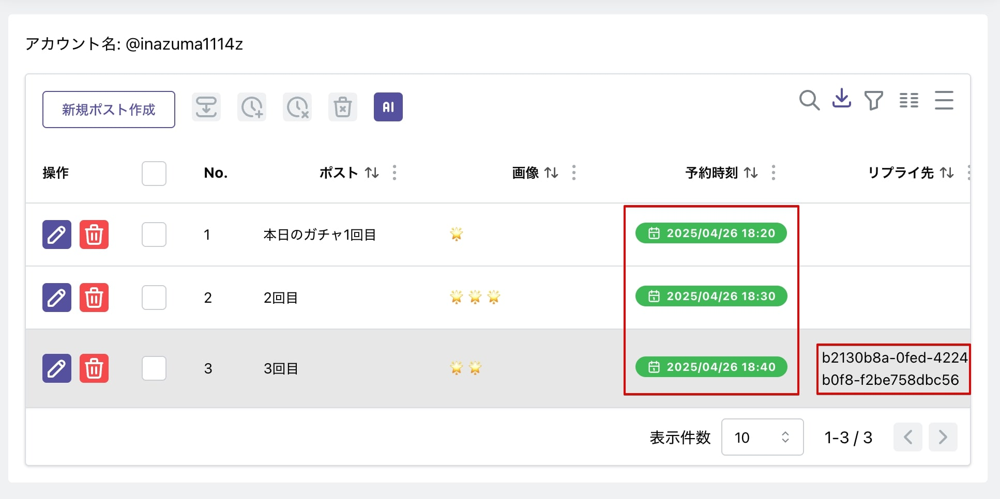
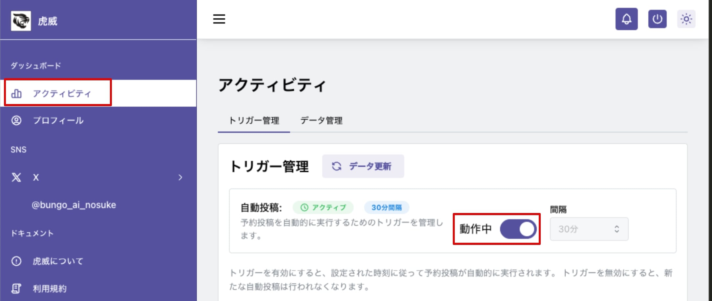
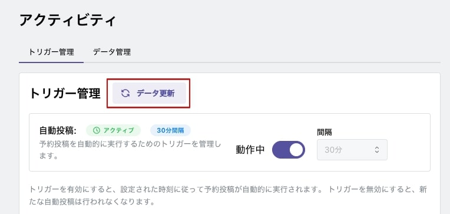
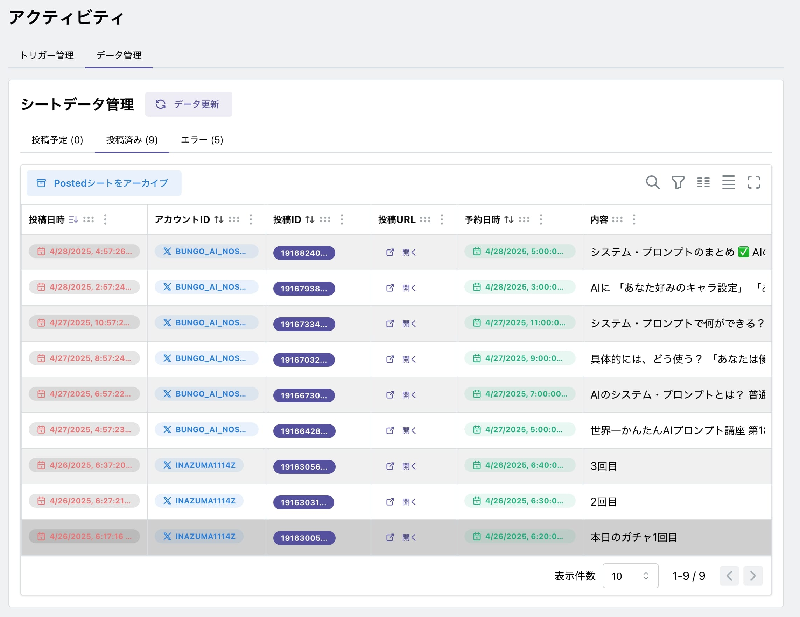

# 自動投稿

ポストを作成し投稿時刻を設定すると自動投稿の準備は完了です。

左側メニューの「アクティビティ」を選択し、トリガー管理欄で「動作中」になっていることを確認します。動作中になっていない場合には、プログラムの起動間隔を選択しスイッチを ON にしてください。

### データ同期について

虎威でポストを作成・編集すると保存時に Google シートと同期します。

Google シート上でプログラムが起動し X へ投稿が行われると Google シートのデータは変わります。

- X へ投稿開始
- X へ投稿完了
  - 成功　 Google シートの Posts シートから投稿されたデータは Posted シートへ移動します。
  - エラー　 Posts シートの PostId に「Error」が入力され以後投稿対象から外れます。また、Errors シートに記録されます。
  - エラーの場合は Gmail にエラーメールが届きます。

これらの Google シート上でのデータの変化は自動では同期しません。アクティビティで「データ更新」を選択してください。

同期後にデータタブから「投稿済み」タブを選択すると成功しているポストを確認できます。「開く」リンクをクリックすると X が開きます。

