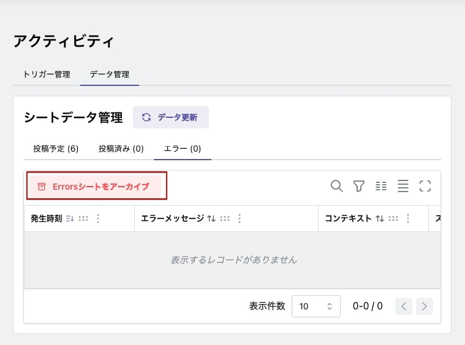

# メンテナンス

## Google シート

投稿完了やエラーの行数が増えますと投稿時のデータ処理に時間がかかるようになります。月に一度程度 Google シートのメンテナンスをお願いします。

アクティビティ画面の「データ管理」-「投稿済み」を選択し、「Posted シートをアーカイブ」をクリックします。Google ドライブに「X_Post_Archive」シートが作成され、日付入りのシートが追加されます。

エラーも同様にアーカイブへ移動させてください。

## Google Apps Script

プログラムに不具合が出た場合、新規機能追加した場合には Google シートの拡張機能「Apps Script」を最新に入れ換えてください。

まずは、最新の[プログラムをダウンロード](https://github.com/kztmk/x_Autopost/releases)します。ダウンロードした zip ファイルを解凍し、「dist」フォルダーにある「code.js」をテキストエディターで開きます。

Google ドライブを開き、X への投稿用シートを開きます。

Google シートのメニュー「拡張機能」-「Apps Script」を選択します。

スクリプト・エディターが開きますので、「code.js」を選択します。

コード部分を全選択し削除します。

テキスト・エディターで開いた最新コードを貼り付け、保存アイコンをクリックします。

「デプロイ」を選択し、「デプロイを管理」をクリックします。

右上の編集アイコンをクリックします。

バージョン選択から「新バージョン」を選択します。

説明欄には、ダウンロードしたバージョンを書いてください。「デプロイ」ボタンをクリックします。

「完了」ボタンをクリックします。

以上で最新プログラムに更新されます。
